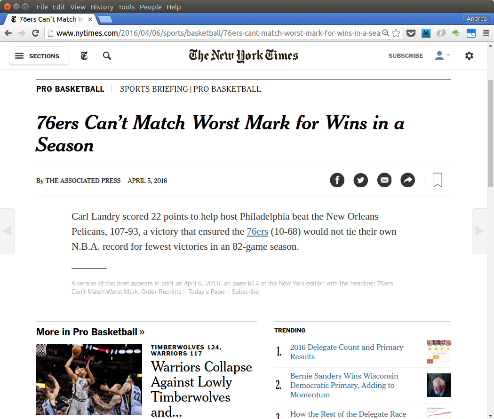
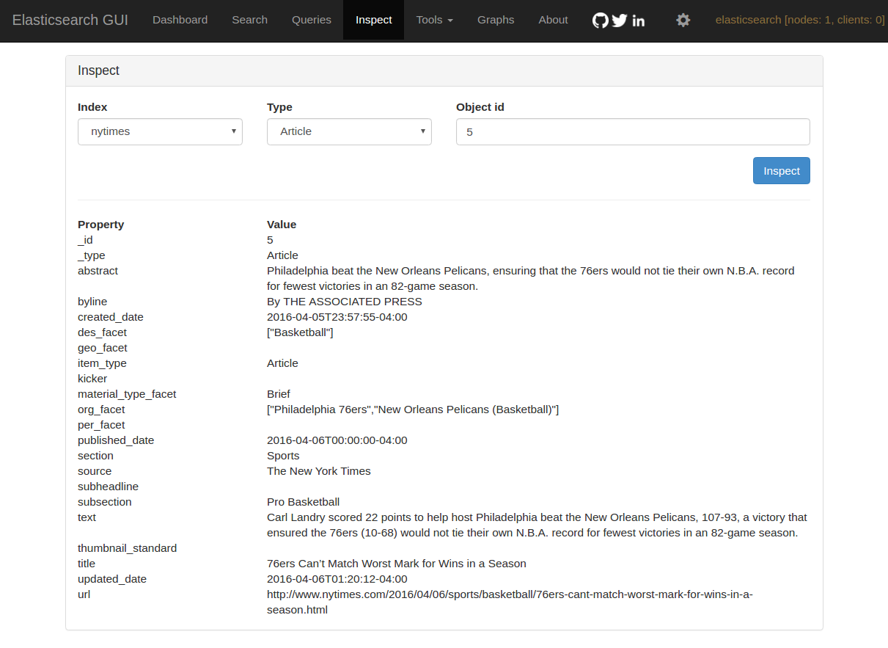
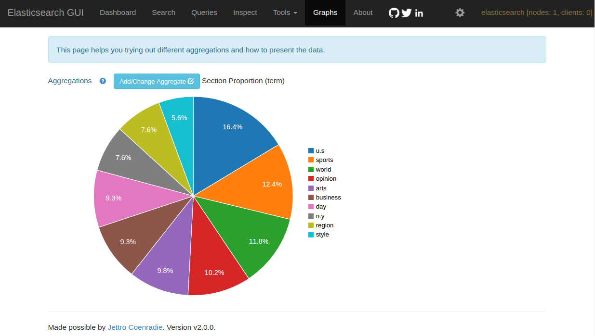

# Elasticsearch and New York Times

Indexed articles from the New York Time in Elasticsearch. I used the NYT Newswire API to get metadata of recently published articles, crawled the url to get the text of the articles and blogs, and stored the results in Elasticsearch for querying.

Below is an overview of the process:


## Document Indexing

Below is an example of a news article which was indexed to Elasticsearch

### Original Article



<br>

---

### Indexed Document



## Term Aggregation for Section Field

Elasticsearch can be queried to produce interesting summaries. Below I used the term aggregation on the Section field to determine the percetage of articles in each section.




## 5 Elasticsearch Queries

- For query results see [Notebook](./Elasticsearch Queries.ipynb)
- For remote queries, change 'localhost' for ip address of remote server

### Query 1 : Count Documents by Index Type (Article, Blog, Interactive, Slideshare, or Video)
```bash
curl -XPOST "localhost:9200/nytimes/_search?search_type=count&pretty" -d '
{ "aggs": { 
    "count_by_type": {
        "terms": { "field": "_type" }
    }
}}'
```

### Query 2 : Count Documents by Section
```bash
curl -XPOST "localhost:9200/nytimes/_search?search_type=count&pretty" -d '
{ "aggs": {
    "by_section": { "terms": { "field": "section" } }
  }
}'
```

### Query 3 : Weekly Count of Documents by Published Date
```bash
curl -XPOST "localhost:9200/nytimes/_search?search_type=count&pretty" -d '
{ "aggs": {
    "weekly_count": {
      "date_histogram": {
        "field": "published_date",
        "interval": "week"
      }
    }
  }
}'
```

### Query 4 : Common Terms In NYT Blog Names
```bash
curl -XPOST "localhost:9200/nytimes/_search?search_type=count&pretty" -d '
{ "aggs": {
    "blog_terms": {
      "terms": { "field": "blog_name"  }
    }
  }
}'
```

### Query 5 : Query Articles Related to the Batman vs Superman Movie
```bash
curl -XPOST 'localhost:9200/nytimes/_search?pretty' -d '
{ "query": { 
    "query_string": {
        "fields": ["title"],
        "query": "batman superman"
     }
  },
  "_source": ["_id", "url", "title"] 
}'
```
