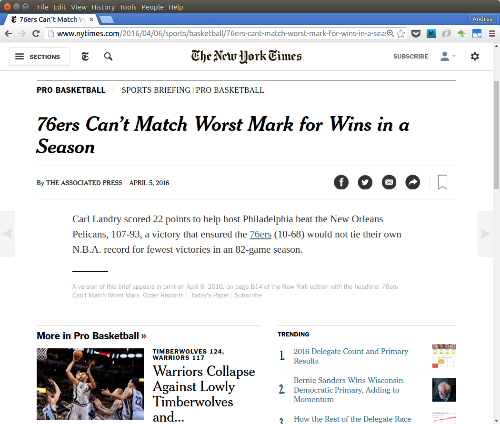
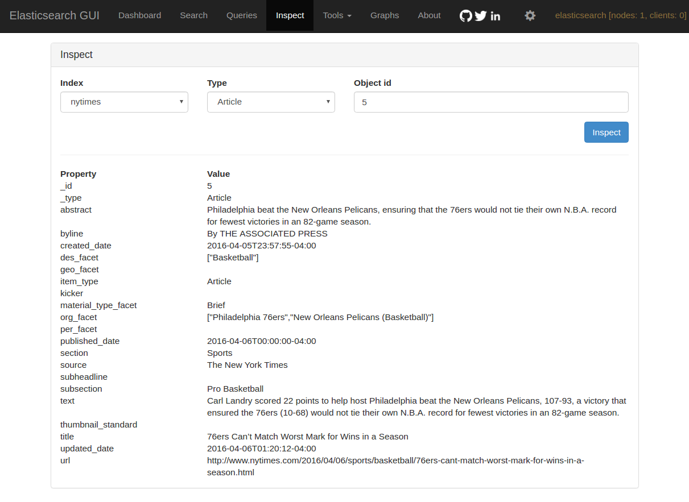
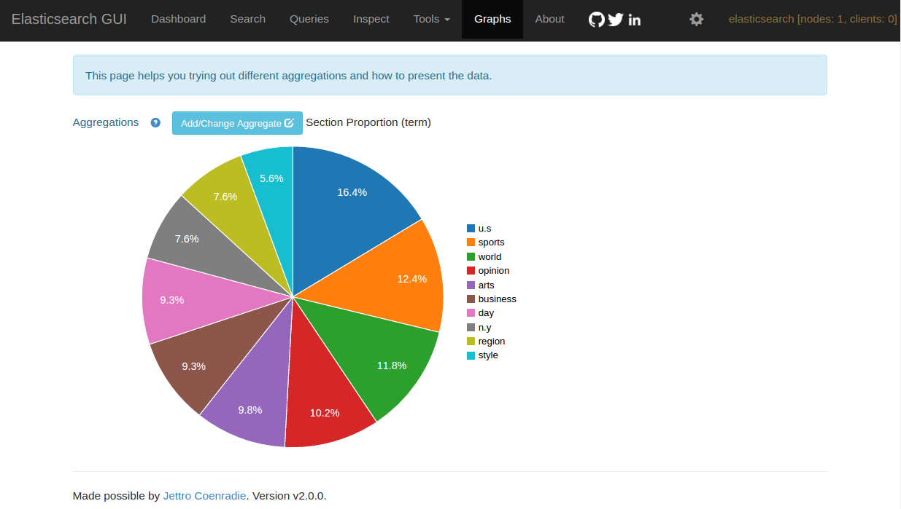

# Elasticsearch and New York Times

Indexed articles from the New York Time in Elasticsearch. I used the NYT Newswire API to get metadata of recently published articles, crawled the url to get the text of the articles and blogs, and stored the results in Elasticsearch for querying.

Below is an overview of the process:

## Document Indexing

Below is an example of a news article which was indexed to Elasticsearch

### Original Article

### Indexed Document

## Term Aggregation for Section Field

Elasticsearch can be queried to produce interesting summaries. Below I used the term aggregation on the Section field to determine the percetage of articles in each section.

